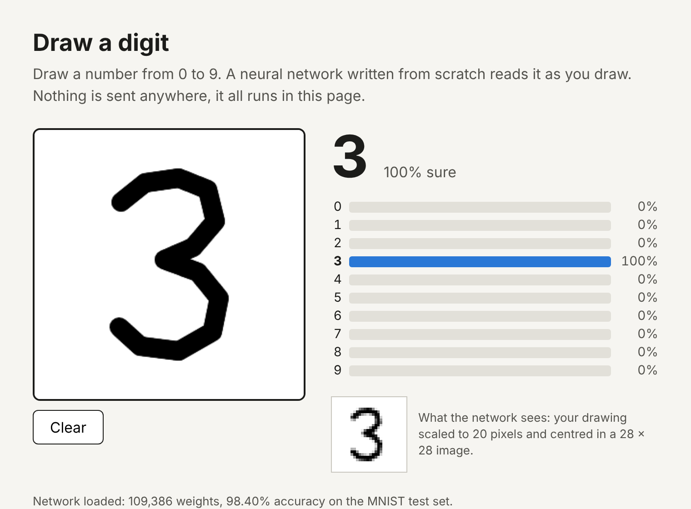

# Draw a digit

Draw a number in the browser and a neural network reads it while you draw.

**Try it: https://imu-002.github.io/draw-a-digit/** (works on a phone)



The network is the one from [mnist-from-scratch](https://github.com/imu-002/mnist-from-scratch), which was trained with NumPy and no machine learning library. This project runs it in the browser, again with no library: the forward pass is about 40 lines of JavaScript in [`network.js`](network.js). Nothing is sent to a server.

## Checking it against the Python version

Rewriting a model in another language is an easy place to make a quiet mistake, such as a transposed weight matrix. So the JavaScript version is run over the same 10,000 MNIST test images:

```
$ node check_accuracy.js ../mnist-from-scratch/data
10000 test images
as they are:                         98.40%  (160 wrong)
```

Same accuracy and the same number of mistakes as Python. The unit tests also compare the output probabilities for 100 images with what Python produced, to 4 decimal places.

## The part that mattered most: preprocessing

The first surprise with a project like this is that a network with 98% test accuracy can be almost useless on real drawings. MNIST digits are not just small images of digits. Each one was fitted into a 20x20 box and placed in a 28x28 image with its centre of mass in the middle. The network has never seen a digit in a corner or a digit that fills the frame.

[`preprocess.js`](preprocess.js) does the same thing to a drawing:

1. Find the bounding box of the ink.
2. Scale it so the longer side is 20 pixels, averaging the source pixels each output pixel covers (so thin strokes do not vanish).
3. Place it in a 28x28 image so the centre of mass lands in the middle.

To measure how much this matters, every test digit was enlarged 2 to 9 times and placed at a random position on a 280x280 canvas, like a drawing would be:

| Input to the network | Accuracy |
|---|---|
| Original test image | 98.40% |
| Random size and position, with the preprocessing | 97.36% |
| Random size and position, canvas simply shrunk to 28x28 | 31.42% |

Without the centring step the network gets two out of three wrong. The page shows the 28x28 image the network actually receives, next to the drawing.

## Run it

The page loads the weights with `fetch`, so it needs to be served, not opened as a file:

```
python3 -m http.server 8000
```

Then open http://localhost:8000. It works with a mouse or a finger.

```
node --test                                        # 13 tests
node check_accuracy.js ../mnist-from-scratch/data  # needs the MNIST files
```

## Files

| File | What it does |
|---|---|
| `network.js` | Loads the weights and runs the forward pass |
| `preprocess.js` | Turns a drawing into an MNIST-style 28x28 image |
| `main.js` | Canvas drawing and the page |
| `export_weights.py` | Converts the NumPy weights to `model.bin` and writes the test fixtures |
| `model.bin`, `model.json` | The weights (109,386 numbers, 437 KB) and the layer sizes |
| `check_accuracy.js` | Full test set check and the preprocessing comparison |
| `test.js` | Unit tests |

## Limitations

- The 97.36% figure is for MNIST digits moved and resized, not for digits drawn with a mouse or finger. Those are a different kind of image (even stroke width, different writing habits), and accuracy on them has not been measured properly. A quick check with one mouse-drawn example of each digit, plus a 1 with a base and a 7 with a bar, read all 12 correctly, which is far too few to give a number.
- The brush width is fixed, so a very small drawing turns into a blob after scaling. A 3 drawn about 40 pixels tall was read as an 8.
- The network is nearly always "100% sure", including on that wrong 8. A plain network like this one is overconfident, and the percentage should not be read as a real probability.
